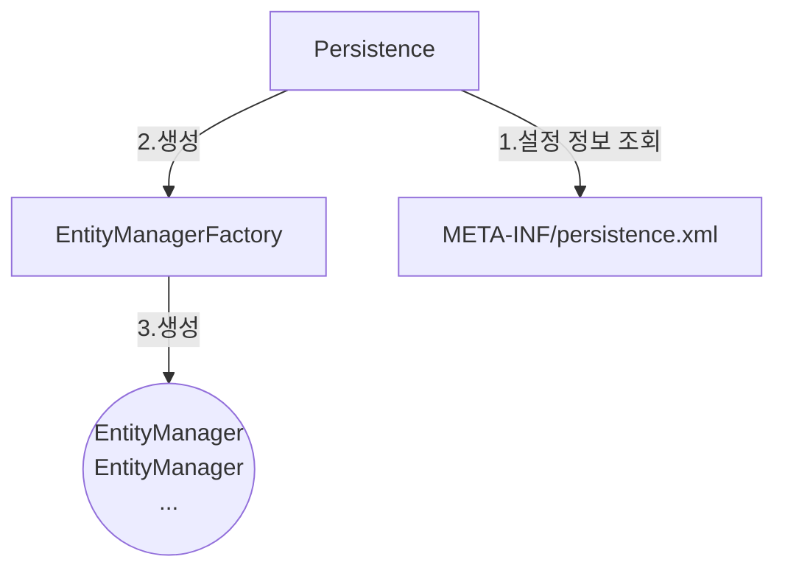

## 주요목적
- **객체와 데이터베이스 간의 매핑**: Java 객체 모델을 데이터베이스 테이블과 맵핑하여 개발자가 SQL을 직접 작성하지 않고도 데이터베이스 작업을 수행할 수 있게 합니다.
- **데이터 접근 간소화**: 데이터베이스 접근 로직을 추상화하여 개발자가 비즈니스 로직에 집중할 수 있도록 합니다.
## 주요 구성 요소
- **Persistence Context**: 애플리케이션 컨텍스트 내에서 데이터베이스와의 연결을 관리하는 컨텍스트입니다. 이 컨텍스트는 엔티티를 데이터베이스에 저장하거나 로드하는 데 사용됩니다.
- **Entity Classes**: 데이터베이스 테이블과 맵핑되는 Java 클래스입니다. `@Entity` 애노테이션을 사용하여 엔티티를 정의합니다.
- **Managed Objects**: 엔티티와 연관된 객체들입니다. `@Entity` 애노테이션이 적용된 클래스의 인스턴스들이 여기에 해당합니다.
- **Persistence Units**: 데이터베이스 연결 정보와 설정을 정의하는 XML 파일 (`persistence.xml`) 또는 Java 설정을 통해 구성됩니다.
## JPA 구동 방식

### 주의 사항
- EntityMangerFactory는 하나만 생성해서 어플리케이션 전체에서 공유
- EntityManager는 쓰레드간에 공유 ❌
- JPA의 모든 변경은 transaction 안에서 실행
## 주요 어노테이션
- **`@Entity`**: 클래스가 엔티티임을 나타냅니다.
    ```java
    @Entity
    public class User {
        @Id
        private Long id;
        private String name;
        private String email;
        // getters and setters
    }
    ```
    
- **`@Table`**: 엔티티가 특정 테이블에 맵핑되도록 지정합니다. 기본적으로 클래스 이름이 테이블 이름으로 사용됩니다.
    ```java
    @Entity
    @Table(name = "USERS")
    public class User {
        // 클래스 내용
    }
    ```
    
- **`@Id`**: 클래스의 기본 키 필드를 지정합니다.
    ```java
    @Id
    @GeneratedValue(strategy = GenerationType.IDENTITY)
    private Long id;
    ```
    
- **`@Column`**: 필드가 특정 데이터베이스 컬럼에 맵핑되도록 지정합니다.
    ```java
    @Column(name = "USER_NAME")
    private String name;
    ```
    
- **`@OneToMany`, `@ManyToOne`, `@OneToMany`, `@ManyToMany`**: 관계형 매핑을 위한 애노테이션입니다.
    
    ```java
    @OneToMany(mappedBy = "user")
    private List<Address> addresses;
    
    @ManyToOne
    @JoinColumn(name = "USER_ID")
    private Department department;
    ```

## 주요기능
- **CRUD (Create, Read, Update, Delete)**: JPA는 엔티티에 대한 기본 CRUD 연산을 제공합니다.
    
    - **`em.persist(entity)`**: 엔티티를 데이터베이스에 저장합니다.
    - **`em.find(entityClass, id)`**: 엔티티를 데이터베이스에서 로드합니다.
    - **`em.merge(entity)`**: 이미 데이터베이스에 저장된 엔티티를 업데이트합니다.
    - **`em.remove(entity)`**: 엔티티를 데이터베이스에서 삭제합니다.
- **쿼리 언어**: JPQL (Java Persistence Query Language)을 사용하여 데이터베이스 쿼리를 작성할 수 있습니다.
    
    ```java
    @Query("SELECT u FROM User u WHERE u.name = :name")
    List<User> findUsersByName(String name);
    ```