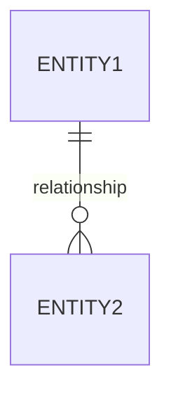
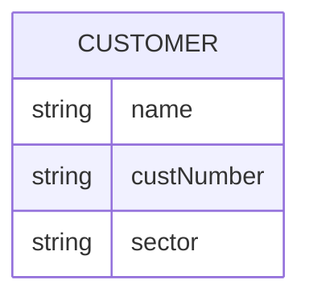
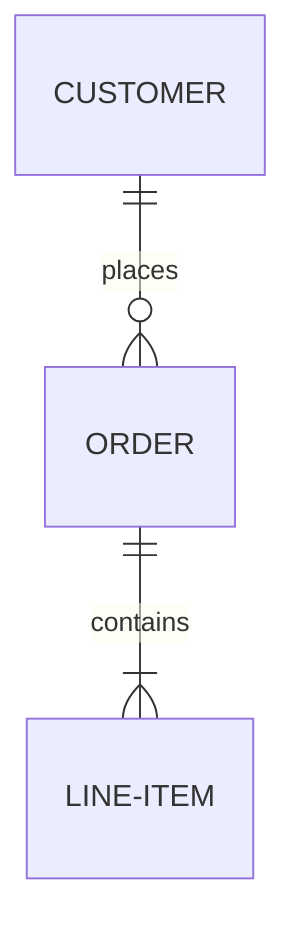
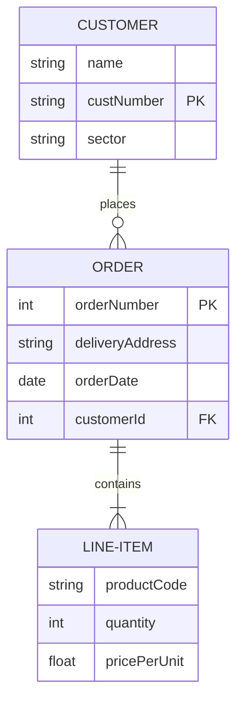

# ER Diagram 기본 문법
- ER (Entity-Relationship) 다이어그램은 데이터베이스의 구조를 시각화하는 데 사용됩니다. Mermaid에서 ER 다이어그램을 그리기 위한 기본 문법은 다음과 같습니다:
## 1. 기본 구조

```
erDiagram
    ENTITY1 ||--o{ ENTITY2 : relationship
```
## 2. 엔티티 정의


```
erDiagram
    CUSTOMER {
        string name
        string custNumber
        string sector
    }
```
## 3. 관계 표현
- 일대일 (1:1): `||--||`
- 일대다 (1:N): `||--o{`
- 다대일 (N:1): `}o--||`
- 다대다 (N:M): `}o--o{`

예시:

```
erDiagram
    CUSTOMER ||--o{ ORDER : places
    ORDER ||--|{ LINE-ITEM : contains
```
## 4. 속성 타입
- `string`: 문자열
- `int`: 정수
- `float`: 부동소수점
- `date`: 날짜
- `boolean`: 불리언
## 5. 키 표시
- PK (Primary Key): `string id PK`
- FK (Foreign Key): `int customerId FK`
## 6. 주석
`%%`를 사용하여 주석을 추가할 수 있습니다.
## 전체 예시


```
erDiagram
    erDiagram
    CUSTOMER ||--o{ ORDER : places
    CUSTOMER {
        string name
        string custNumber PK
        string sector
    }
    ORDER ||--|{ LINE-ITEM : contains
    ORDER {
        int orderNumber PK
        string deliveryAddress
        date orderDate
        int customerId FK
    }
    LINE-ITEM {
        string productCode
        int quantity
        float pricePerUnit
    }
```

> 이 기본 문법을 사용하여 복잡한 데이터베이스 구조를 표현할 수 있습니다. Mermaid의 ER 다이어그램 기능은 지속적으로 업데이트되므로, 최신 기능은 공식 문서를 참조하는 것이 좋습니다.