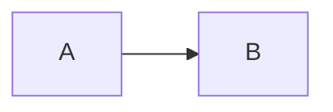
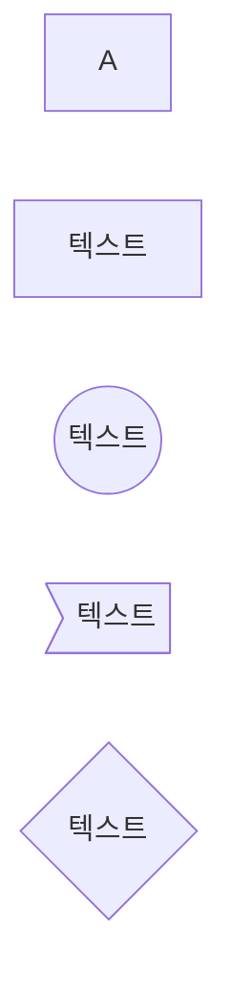
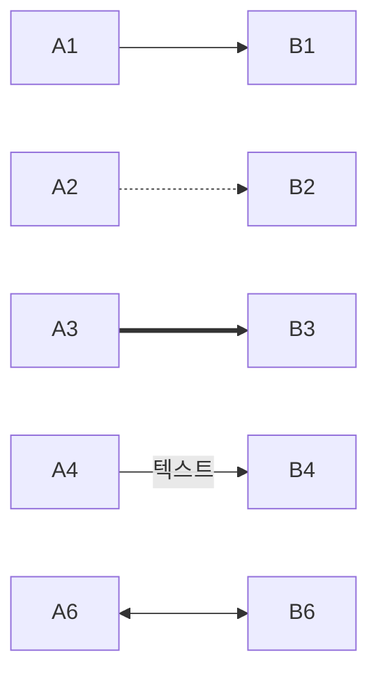
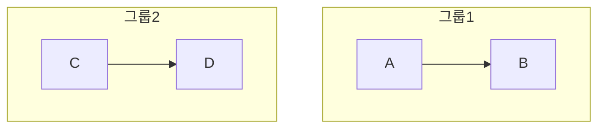
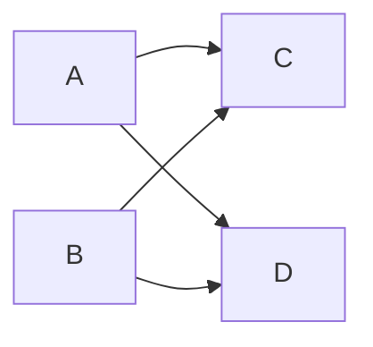

# Mermaid Flowchart 기본 문법
## 1. 기본 구조


```markdown
flowchart LR
    A --> B
```
- `flowchart` 키워드로 시작 (또는 `graph`)
- 방향 지정: LR (왼쪽에서 오른쪽), TD (위에서 아래), RL, BT
## 2. 노드 정의
- 기본 노드: `A`
- 텍스트 노드: `B[텍스트]`
- 원형 노드: `C((텍스트))`
- 비대칭 노드: `D>텍스트]`
- 마름모: `E{텍스트}`

## 3. 연결선
- 기본 화살표: `A --> B`
	- 한방향으로의 흐름
- 점선 화살표: `A -.-> B`
	- 조건부 또는 간접적인 연결
- 굵은 선 화살표: `A ==> B`
- 텍스트 포함 화살표: `A -->|텍스트| B`
	- 연결에 대한 설명이나 조건을 추가
- 양방향 화살표: `<->`

## 4. 서브그래프

```
flowchart TB
    subgraph 그룹1
        A --> B
    end
    subgraph 그룹2
        C --> D
    end
```
## 5. 스타일링

- 노드 스타일: `style A fill:#f9f,stroke:#333,stroke-width:4px`
- 클래스 정의: `classDef className fill:#f9f,stroke:#333,stroke-width:4px`
- 클래스 적용: `class A,B className`
## 6. 복잡한 연결


```markdown
flowchart LR
    A & B --> C & D
```
## 7. 주석
- `%%` 로 시작하는 줄은 주석 처리됩니다.
## 8. 팁
- 노드 ID에 공백을 사용하려면 따옴표로 묶습니다: `"노드 1"`
- 특수 문자를 노드 ID에 사용할 때는 따옴표로 묶습니다.

> 이 기본 문법을 조합하여 복잡한 플로우차트를 만들 수 있습니다. Mermaid는 지속적으로 업데이트되므로, 최신 기능은 공식 문서를 참조하는 것이 좋습니다.