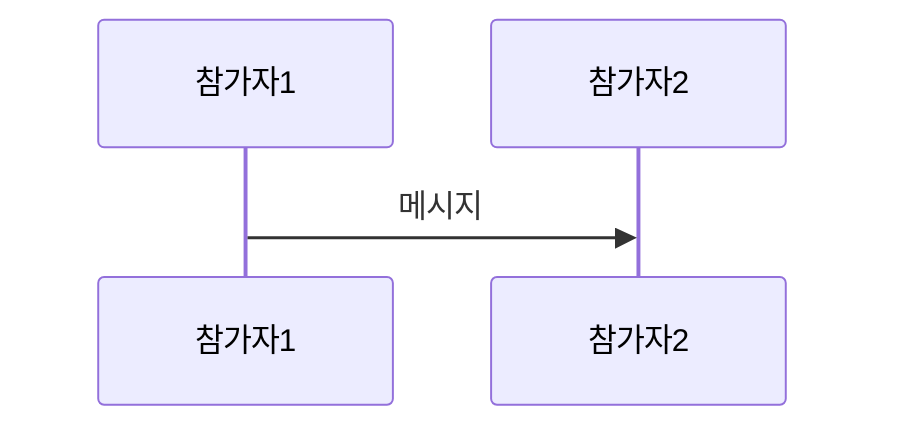
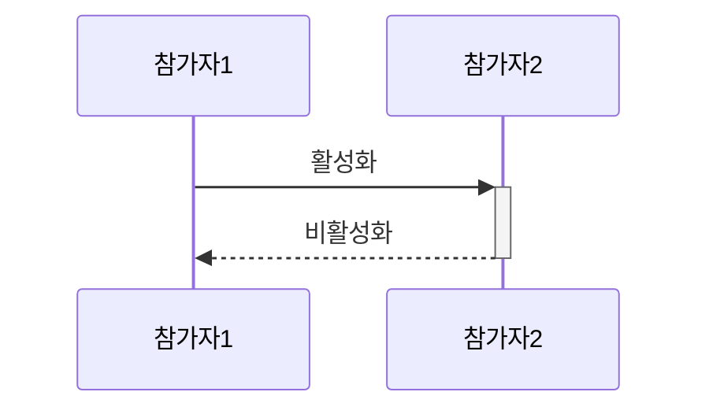
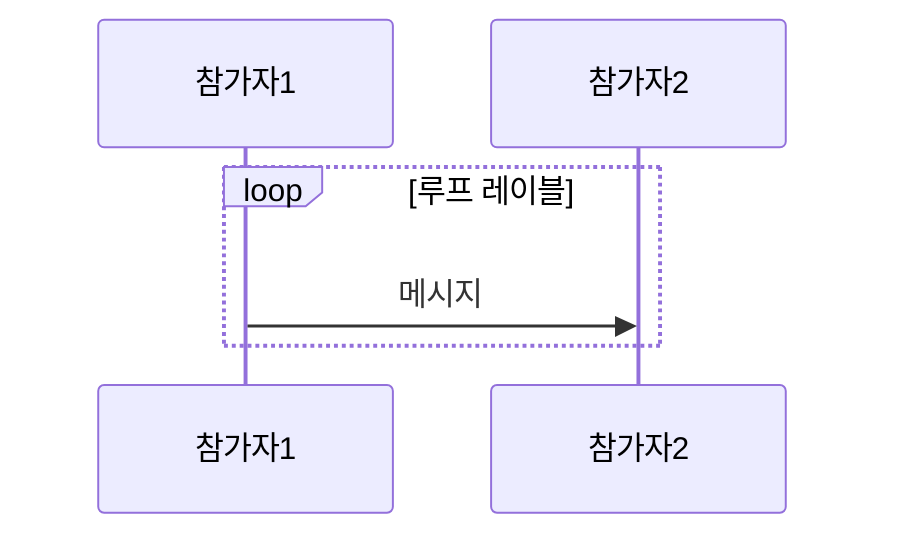
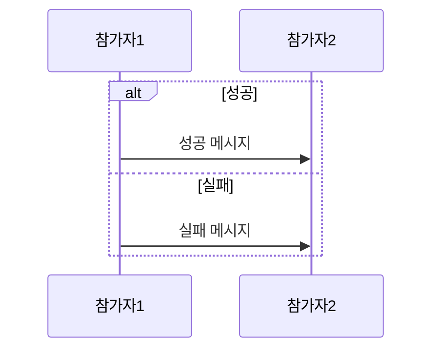
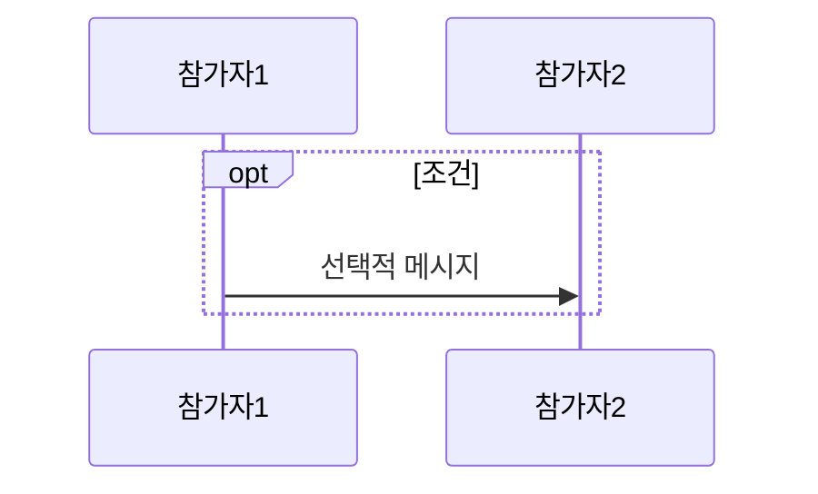
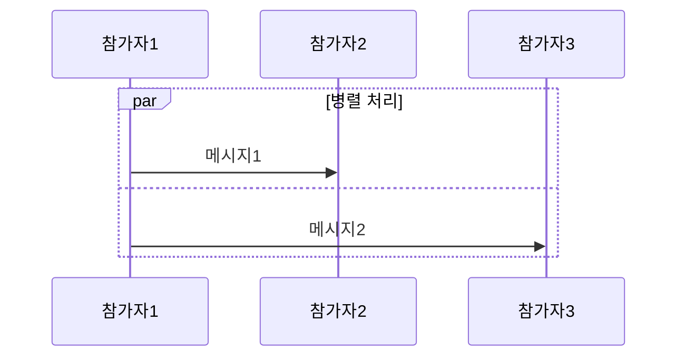
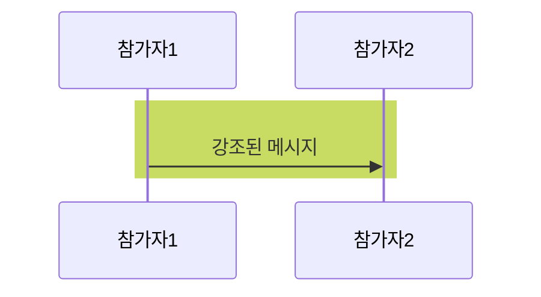

# Mermaid 시퀀스 다이어그램 기본 문법

## 1. 기본 구조


```markdown
sequenceDiagram
    참가자1->>참가자2: 메시지
```
## 2. 참가자 정의
- 기본: `참가자1->>참가자2: 메시지`
- 명시적 정의: `participant 참가자1`
- 별칭 사용: `participant A as 참가자1`
## 3. 메시지 유형
- 실선 화살표: `->>` 또는 `->>`
- 점선 화살표: `-->>` 또는 `-->>`
- 실선 (개방 화살표): `->`
- 점선 (개방 화살표): `-->`
- 굵은 선 화살표: ` ==>>`
- 굵은 점선 화살표: ` ==>`
## 4. 활성화 및 비활성화

```markdown
sequenceDiagram
    참가자1->>+참가자2: 활성화
    참가자2-->>-참가자1: 비활성화
```
## 5. 노트
- 한 쪽에 노트: `Note right of 참가자1: 텍스트`
- 양쪽에 노트: `Note over 참가자1,참가자2: 텍스트`
## 6. 루프

```markdown
flowchart TB
    subgraph 그룹1
        A --> B
    end
    subgraph 그룹2
        C --> D
    end
```
## 7. 대안 경로

```
flowchart TB
    subgraph 그룹1
        A --> B
    end
    subgraph 그룹2
        C --> D
    end
```
## 8. 선택적 경로

```
flowchart TB
    subgraph 그룹1
        A --> B
    end
    subgraph 그룹2
        C --> D
    end
```
## 9. 병렬 처리

```
flowchart TB
    subgraph 그룹1
        A --> B
    end
    subgraph 그룹2
        C --> D
    end
```
## 10. 배경 강조

## 11. 주석

- `%%` 로 시작하는 줄은 주석 처리됩니다.

> 이 기본 문법을 조합하여 복잡한 시퀀스 다이어그램을 만들 수 있습니다. Mermaid는 지속적으로 업데이트되므로, 최신 기능은 공식 문서를 참조하는 것이 좋습니다.

## 12. 참가자
Mermaid sequence diagram에서 사용할 수 있는 참가자 종류는 다음과 같습니다:

1. 기본 참가자 (Default Participant)
   ```mermaid
   sequenceDiagram
   participant Alice
   participant Bob
   ```

2. 액터 (Actor)
   ```mermaid
   sequenceDiagram
   actor A as Alice
   actor B as Bob
   ```

3. 데이터베이스 (Database)
   ```mermaid
   sequenceDiagram
   participant DB as Database
   ```

4. 외부 엔티티 (External Entity)
   ```mermaid
   sequenceDiagram
   participant EE as "External Entity"
   ```

5. 컨트롤 (Control)
   ```mermaid
   sequenceDiagram
   participant C as Control
   ```

6. 엔티티 (Entity)
   ```mermaid
   sequenceDiagram
   participant E as Entity
   ```

7. 바운더리 (Boundary)
   ```mermaid
   sequenceDiagram
   participant B as Boundary
   ```

8. 컬렉션 (Collections)
   ```mermaid
   sequenceDiagram
   participant Coll as Collections
   ```

각 참가자 유형은 다이어그램에서 다른 아이콘이나 모양으로 표현됩니다. 참가자 유형을 지정하려면 `participant` 키워드 대신 해당 유형의 키워드(예: `actor`, `database` 등)를 사용하면 됩니다.

Sources
