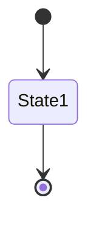
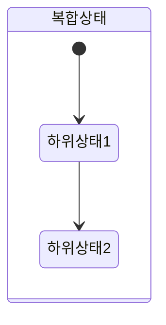
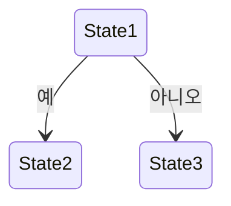
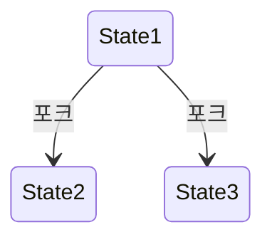
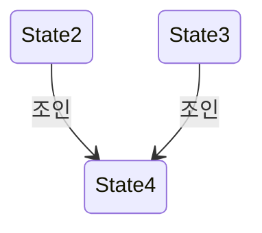
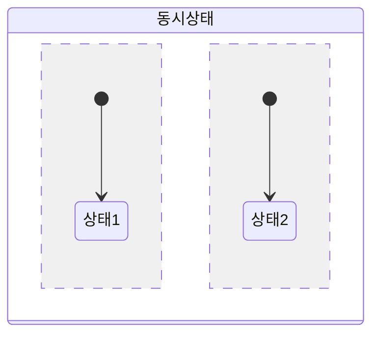
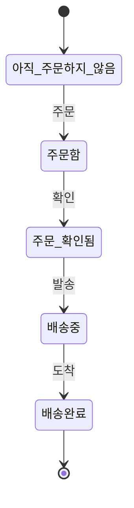

# 상태 다이어그램 (State Diagram) 기본 문법
> 상태 다이어그램(State Diagram)은 객체의 생존 기간 동안 가질 수 있는 상태 변화를 시각적으로 표현하는 UML 다이어그램입니다. 
## 1. 기본 구조

```
stateDiagram-v2
    [*] --> State1
    State1 --> [*]
```
## 2. 상태 정의
> •	객체가 특정 시점에 가지는 조건이나 상황
   •	둥근 모서리의 사각형으로 표현
   •	상태 이름은 사각형 내부 상단에 기술

- 단순 상태: `State1`
- 설명이 있는 상태: `State2 : 이것은 상태 2입니다`
## 3. 전이 (Transitions)
> •	한 상태에서 다른 상태로의 변화
   •	화살표로 표현

- 기본 전이: `State1 --> State2`
- 레이블이 있는 전이: `State1 --> State2 : 이벤트`
## 4. 복합 상태 (Composite States)

```
stateDiagram-v2
    state 복합상태 {
        [*] --> 하위상태1
        하위상태1 --> 하위상태2
    }
```
## 5. 선택 (Choice)


```
stateDiagram
        [*] --> State1
        State1 --> State2 : 이벤트1
        State2 --> [*] : 이벤트2
        State2 --> State1 : 이벤트3
```
## 6. 포크 (Fork)


```
stateDiagram-v2
    State1 --> State2 : 포크
    State1 --> State3 : 포크
```
## 7. 조인 (Join)


```
stateDiagram-v2
    State2 --> State4 : 조인
    State3 --> State4 : 조인
```
## 8. 동시성 (Concurrency)


```
stateDiagram-v2
    state 동시상태 {
        [*] --> 상태1
        --
        [*] --> 상태2
    }
```
## 9. 주석

`%%`를 사용하여 주석을 추가할 수 있습니다.

## 전체 예시



이 기본 문법을 사용하여 다양한 상태와 전이를 표현할 수 있습니다. Mermaid의 상태 다이어그램 기능은 지속적으로 업데이트되므로, 최신 기능은 공식 문서를 참조하는 것이 좋습니다.

### 기본 개념
**상태 다이어그램(State Diagram)은 객체의 생존 기간 동안 가질 수 있는 상태 변화를 시각적으로 표현하는 UML 다이어그램입니다. 주요 개념은 다음과 같습니다:

1. 상태 (State)
   - 객체가 특정 시점에 가지는 조건이나 상황
   - 둥근 모서리의 사각형으로 표현
   - 상태 이름은 사각형 내부 상단에 기술

2. 전이 (Transition)
   - 한 상태에서 다른 상태로의 변화
   - 화살표로 표현

3. 이벤트 (Event)
   - 상태 전이를 유발하는 자극
   - 전이 화살표 위에 표시

4. 초기 상태 (Initial State)
   - 객체의 시작 상태
   - 채워진 검은 원으로 표시

5. 종료 상태 (Final State)
   - 객체의 생명 주기 종료
   - 이중 원으로 표시

6. 액션 (Action)
   - 상태 전이 시 수행되는 동작

7. 복합 상태 (Composite State)
   - 하위 상태를 포함하는 상태

8. 동시성 (Concurrency)
   - 객체가 동시에 여러 상태를 가질 수 있음을 표현

상태 다이어그램은 객체의 동적 행위를 모델링하고, 복잡한 시스템의 상태 변화를 이해하는 데 유용합니다. 소프트웨어 개발, 임베디드 시스템 설계 등 다양한 분야에서 활용됩니다.

Sources
[1] UML 상태 다이어그램 기호, 예제 및 튜토리얼 https://gitmind.com/kr/state-diagram.html
[2] [소프트웨어 공학] StateDiagram(상태 다이아그램) 이란 ? - 꾸준희 https://eehoeskrap.tistory.com/17
[3] 복잡한 시스템도 한눈에! 상태 다이어그램 완벽 정복 - Edrawsoft https://www.edrawsoft.com/kr/diagram-tutorial/what-is-the-state-diagram.html
[4] 상태 머신 다이어그램이란 무엇입니까? -UML 다이어그램 가이드 https://www.processon.io/ko/blog/uml-state-machine-diagram
[5] 상태 다이어그램 - 학교공부일기장 https://guhonga.tistory.com/96
[6] 다이어그램의 개념&종류 한번 알고 가세요! - Boardmix https://boardmix.com/kr/skills/diagram-concepts-and-types/
[7] 상태 다이어그램 - 네이버 블로그 https://blog.naver.com/jwyoon25/221526186609
**