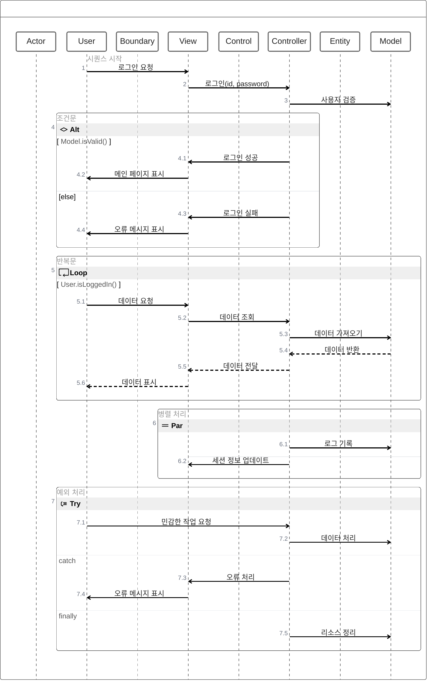

> [!NOTE] Zen UML
> Mermaid Zen UML은 시퀀스 다이어그램을 더 간단하고 직관적으로 표현할 수 있는 문법을 제공합니다. 기본 문법과 예제는 다음과 같습니다:
## 기본 문법

1. 참가자 정의:
   - 암시적 정의: 메시지에서 직접 사용
   - 명시적 정의: `Actor`, `Boundary`, `Control`, `Entity` 등의 키워드 사용

2. 메시지 유형:
   - 동기 메시지: `->`
   - 비동기 메시지: `->>`
   - 응답 메시지: `-->`
   - 생성 메시지: `new` 키워드 사용

3. 중첩 구조:
   - 중괄호 `{}` 사용

4. 주석:
   - `// 주석 내용`

5. 제어 구조:
   - 반복: `while`, `for`, `forEach`, `loop`
   - 조건: `if`, `else if`, `else`
   - 옵션: `opt`
   - 병렬 처리: `par`
   - 예외 처리: `try`, `catch`, `finally`

## 예제

이 예제는 사용자 로그인 프로세스, 데이터 요청 루프, 병렬 처리, 그리고 예외 처리를 포함한 복잡한 시나리오를 Zen UML로 표현하고 있습니다. Zen UML의 간결한 문법을 통해 복잡한 시스템 상호작용을 명확하게 표현할 수 있습니다.

Sources
[1] Mermaid를 이용한 시퀀스 다이어그램 - velog https://velog.io/@qhflrnfl4324/Mermaid%EB%A5%BC-%EC%9D%B4%EC%9A%A9%ED%95%9C-%EC%8B%9C%ED%80%80%EC%8A%A4-%EB%8B%A4%EC%9D%B4%EC%96%B4%EA%B7%B8%EB%9E%A8
[2] ZenUML - Mermaid https://mermaid.js.org/syntax/zenuml.html
[3] [Markdown] mermaid로 UML 만들기 - 아마란스 생각 https://amaran-th.github.io/%EC%86%8C%ED%94%84%ED%8A%B8%EC%9B%A8%EC%96%B4%20%EC%84%A4%EA%B3%84/%5BMarkdown%5D%20mermaid%EB%A1%9C%20UML%20%EB%A7%8C%EB%93%A4%EA%B8%B0/
[4] [markdown] mermaid를 이용해서 UML 그리기 - 플로우차트 https://sabarada.tistory.com/209
