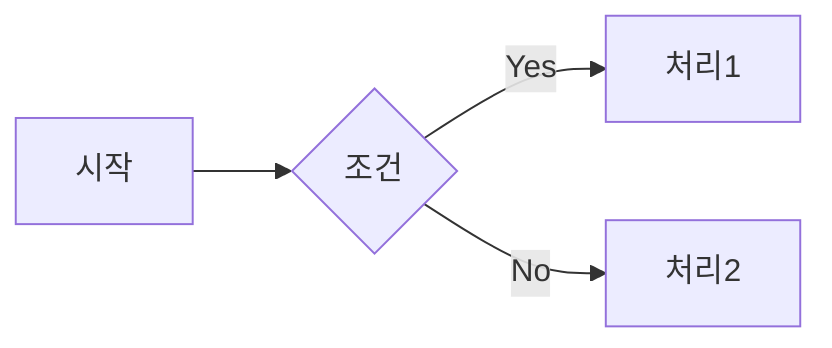
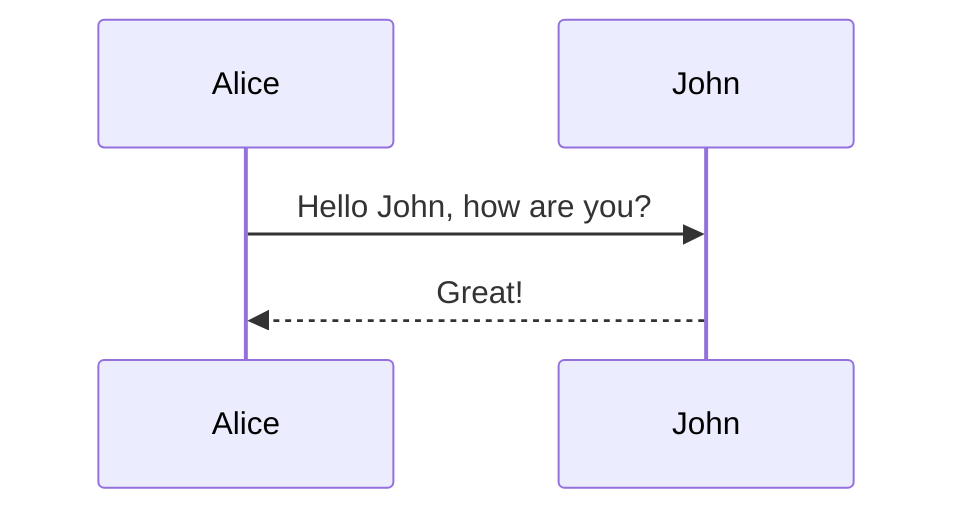
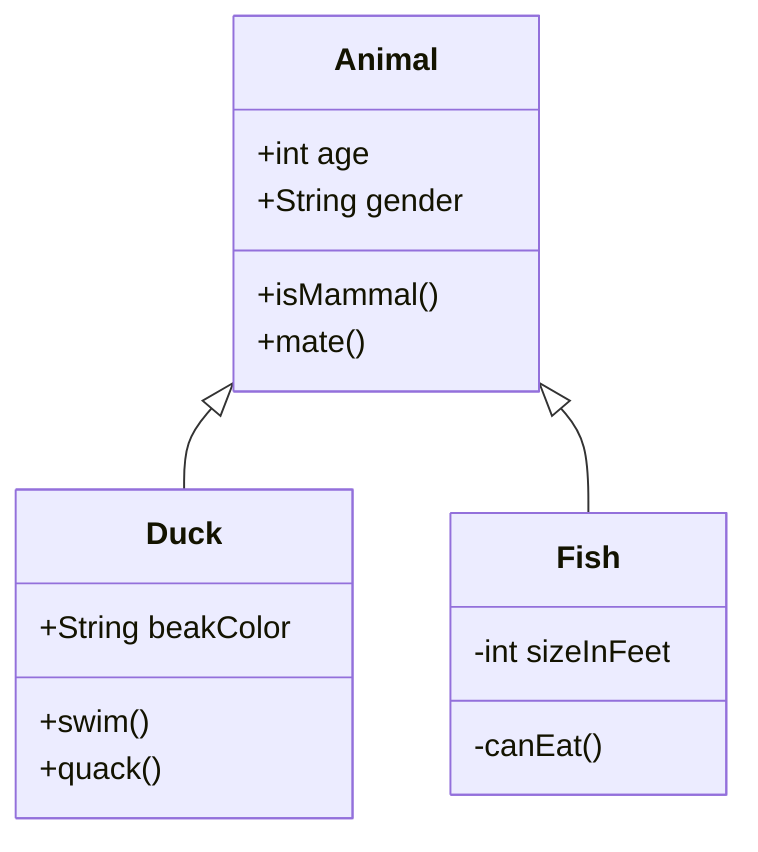
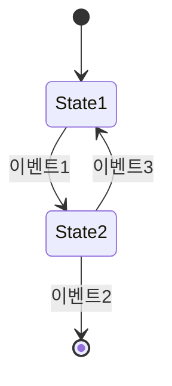
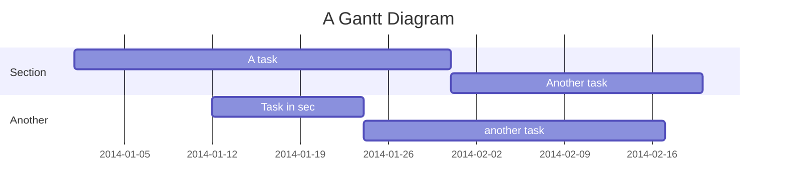
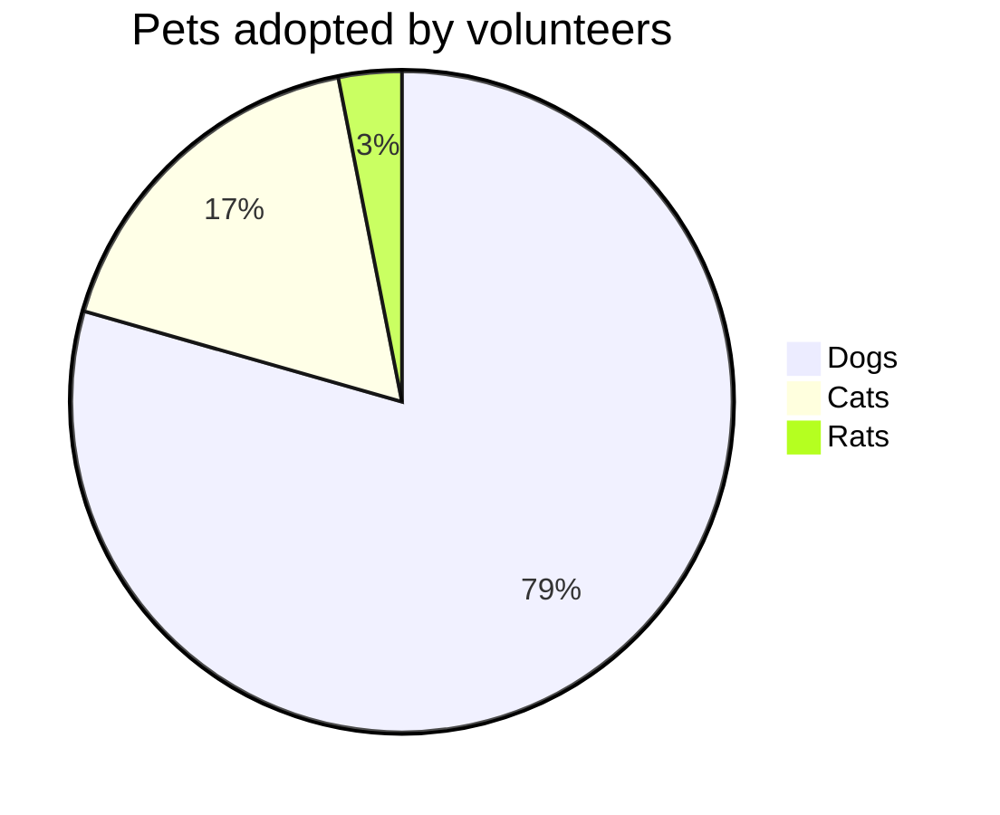
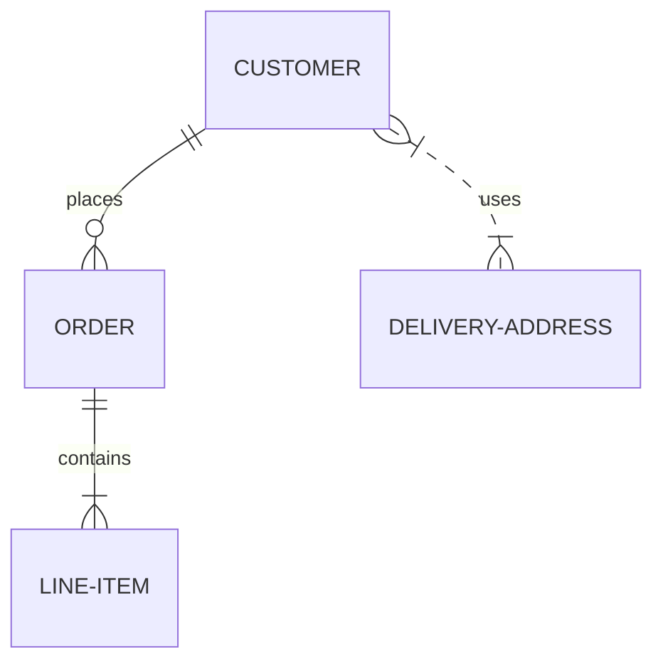

# Mermaid 차트 종류 및 문법

## 1. 플로우차트 (Flowchart)
### 개요
- 노드와 엣지를 사용하여 프로세스나 워크플로우를 표현하는 다이어그램입니다.
### 예시

### 문법
```
flowchart LR
    A[시작] --> B{조건}
    B -->|Yes| C[처리1]
    B -->|No| D[처리2]
```

## 2. 시퀀스 다이어그램 (Sequence Diagram)
### 개요
- 시간 순서에 따른 객체 간 상호작용을 표현하는 다이어그램입니다.
### 예시

### 문법
```
sequenceDiagram
    Alice->>John: Hello John, how are you?
    John-->>Alice: Great!
```

## 3. 클래스 다이어그램 (Class Diagram)

### 개요
- 클래스의 구조와 관계를 표현하는 다이어그램입니다.
### 예시

### 문법
```
classDiagram
    Animal <|-- Duck
    Animal <|-- Fish
    Animal : +int age
    Animal : +String gender
    Animal: +isMammal()
    Animal: +mate()
    class Duck{
      +String beakColor
      +swim()
      +quack()
    }
    class Fish{
      -int sizeInFeet
      -canEat()
    }
```

##  4. 상태 다이어그램 (State Diagram)
### 개요
- 시스템 상태 변화 추적, 컴포넌트 상태 관리 

    
```markdown
    ```mermaid
    stateDiagram
        [*] --> State1
        State1 --> State2 : 이벤트1
        State2 --> [*] : 이벤트2
        State2 --> State1 : 이벤트3
```
## 5. 간트 차트 (Gantt Chart)
### 개요
- 프로젝트 일정을 시각화하는 차트입니다.
### 예시

### 문법
```
gantt
    title A Gantt Diagram
    dateFormat  YYYY-MM-DD
    section Section
    A task           :a1, 2014-01-01, 30d
    Another task     :after a1  , 20d
    section Another
    Task in sec      :2014-01-12  , 12d
    another task      : 24d
```

## 6. 파이 차트 (Pie Chart)
### 개요
- 데이터를 원형으로 표현하는 차트입니다.
### 예시

### 문법
```
pie title Pets adopted by volunteers
    "Dogs" : 386
    "Cats" : 85
    "Rats" : 15
```

## 6. ER 다이어그램 (Entity Relationship Diagram)

### 개요
- 데이터베이스의 엔티티와 관계를 표현하는 다이어그램입니다.
### 예시

### 문법
```
erDiagram
    CUSTOMER ||--o{ ORDER : places
    ORDER ||--|{ LINE-ITEM : contains
    CUSTOMER }|..|{ DELIVERY-ADDRESS : uses
```

> Mermaid는 이 외에도 상태 다이어그램, 사용자 여정 다이어그램, Git 그래프 등 다양한 차트를 지원합니다. 각 차트 유형은 고유한 문법과 기능을 가지고 있으며, Mermaid는 지속적으로 업데이트되어 새로운 기능과 차트 유형이 추가될 수 있습니다.

Sources
[1] Intro syntax - Mermaid Chart https://docs.mermaidchart.com/mermaid/intro
[2] Examples | Mermaid https://mermaid.js.org/syntax/examples.html
[3] Basic overview of creating flowcharts using Mermaid | CKEditor https://ckeditor.com/blog/basic-overview-of-creating-flowcharts-using-mermaid/
[4] Mermaid flowcharts and diagrams example - CKEditor 5 https://ckeditor.com/docs/ckeditor5/latest/features/mermaid.html
[5] Blog - Use Mermaid syntax to create diagrams - draw.io https://www.drawio.com/blog/mermaid-diagrams
[6] Flowcharts - Basic Syntax | Mermaid - GitHub Pages https://emersonbottero.github.io/mermaid-docs/syntax/flowchart.html
[7] Diagram Syntax | Mermaid - GitHub Pages https://emersonbottero.github.io/mermaid-docs/intro/n00b-syntaxReference.html
[8] Mermaid Cheat Sheet @ https://jojozhuang.github.io https://jojozhuang.github.io/tutorial/mermaid-cheat-sheet/
[9] Flowcharts Syntax | Mermaid https://mermaid.js.org/syntax/flowchart.html
[10] Mermaid diagrams | Writerside Documentation - JetBrains https://www.jetbrains.com/help/writerside/mermaid-diagrams.html
[11] Block Diagram Syntax - Mermaid https://mermaid.js.org/syntax/block.html
