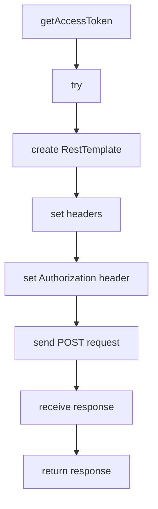

## 표
![[Pasted image 20241221230815.png]]
#### ROLE
- meta
	- 분석에 사용하지 않지만 정보성으로 남겨둠
- feature
	- 예측을 하고자 하는 원인
	- 독립 변수
- target
	- 예측하고자 하는 데이터
	- 종속변수
- skip
	- 사용안함

```mermaid
graph TD;
    A[getAccessToken] --> B[try]
    B --> C[create RestTemplate]
    C --> D[set headers]
    D --> E[set Authorization header]
    E --> F[send POST request]
    F --> G[receive response]
    G --> H[return response]

```
